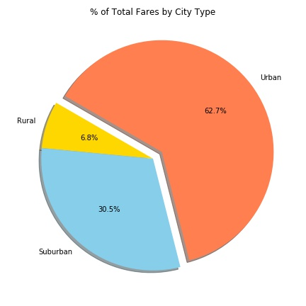

# Matplotlib Homework

I. Pymaceuticals Analysis:
  1. After using the drug for 45 days, the mice was died gradually regarding of the treatment of all drugs.
  2. There are only two drug proving positive effect that reduces the size of tumor.
  3. All drugs cause the metastatic for mice.  
  
  
  
  
  
  
  
  
  
  
  
  
  

II. Pyber Analysis:
  1. Most of cities in data are urban, about half of total.
  2. In rural cities, there are most long trips, so the average fare in rural are highest among city types in analysis.
  3. Although suburban cities are about one sixth of total cities, the total riders and fares are almost 30% of total.
  
  
  
  
  
  
  
  
  
  
  
