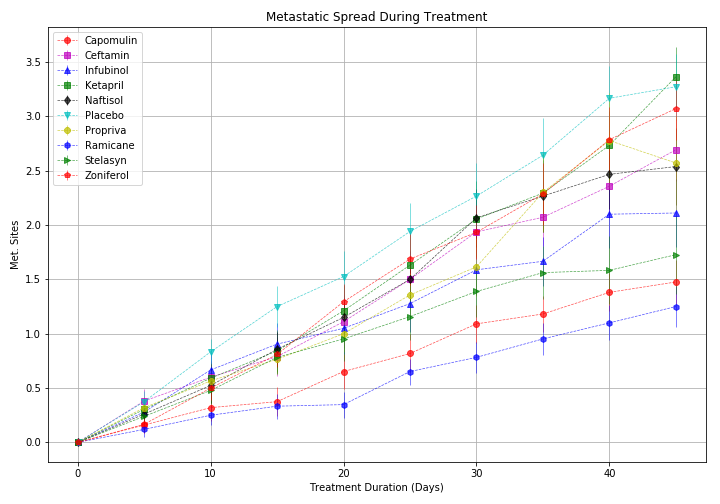

# Matplotlib Homework

I. Pymaceuticals Analysis:
  1. After using the drug for 45 days, the mice was died gradually regarding of the treatment of all drugs.
  2. There are only two drug proving positive effect that reduces the size of tumor.
  3. All drugs cause the metastatic for mice.  
  
  
  
  
  
  
  
  
  
  
  
  
  

II. Pyber Analysis:
  1. 
  
  
  
  
  
  
  
  
  
  
  
